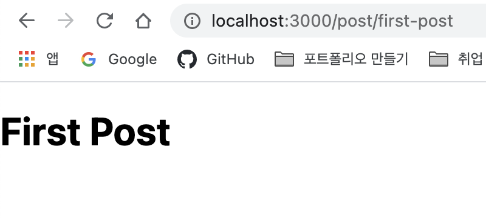
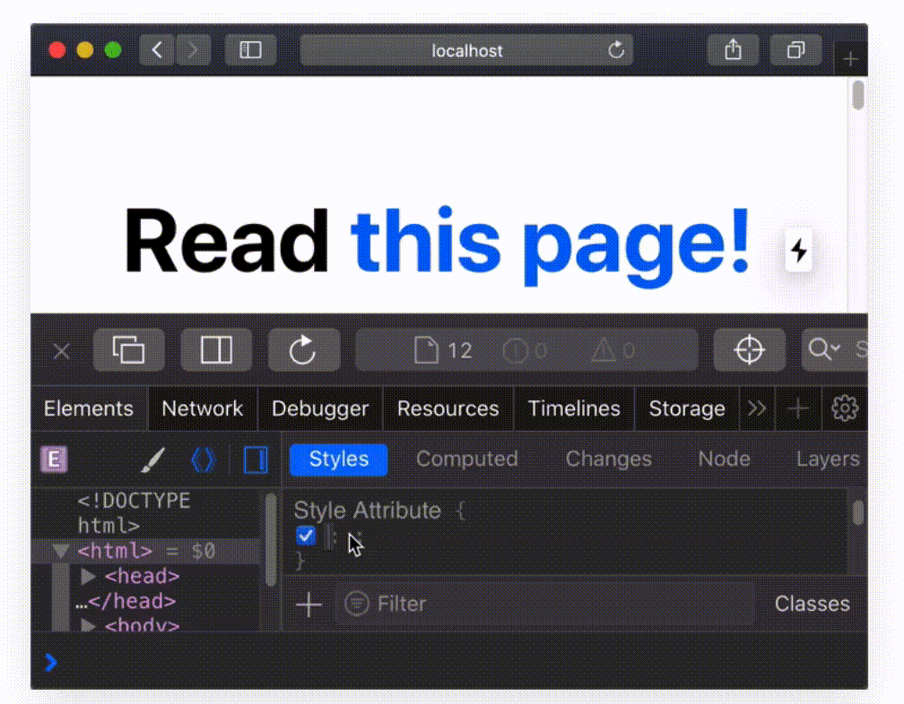
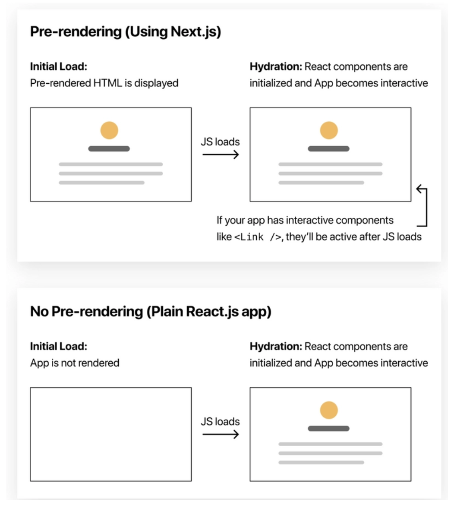
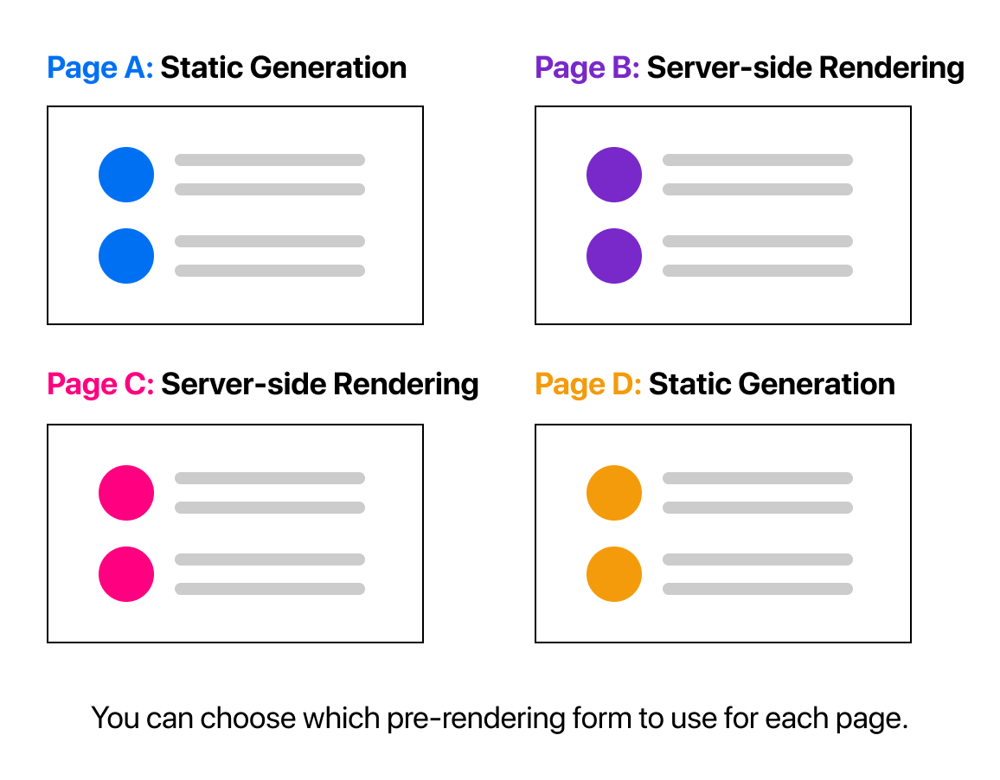
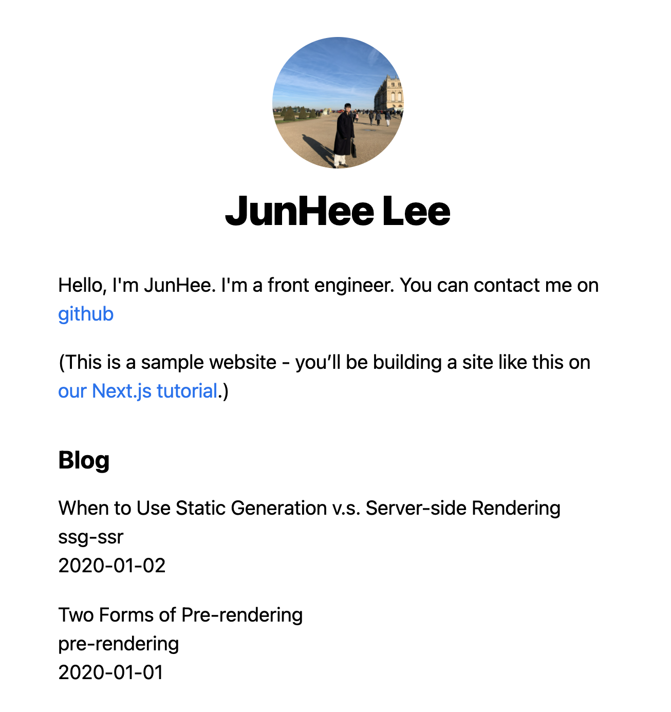
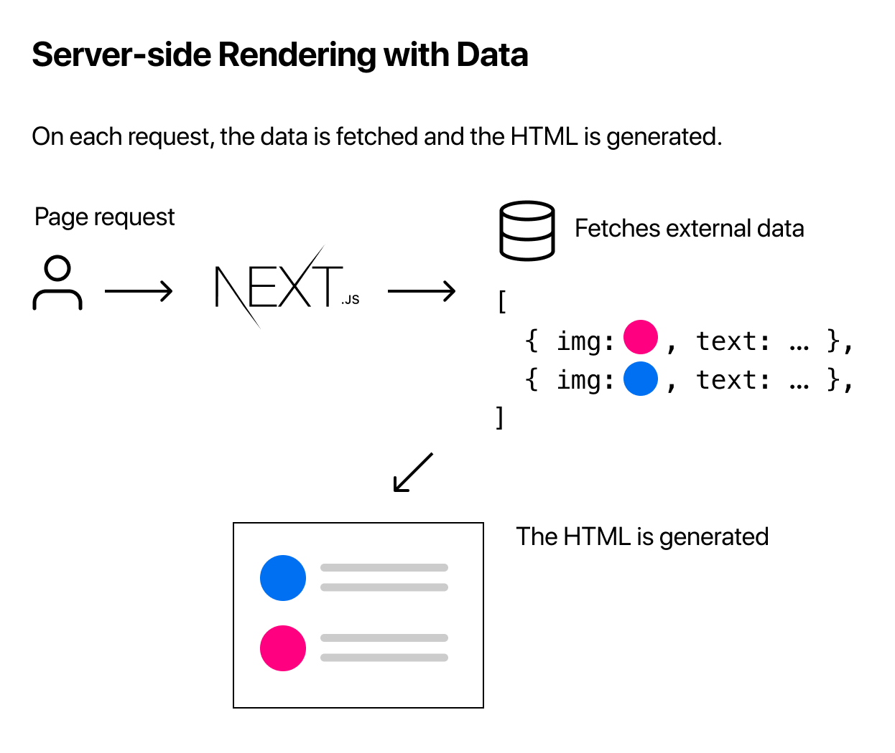
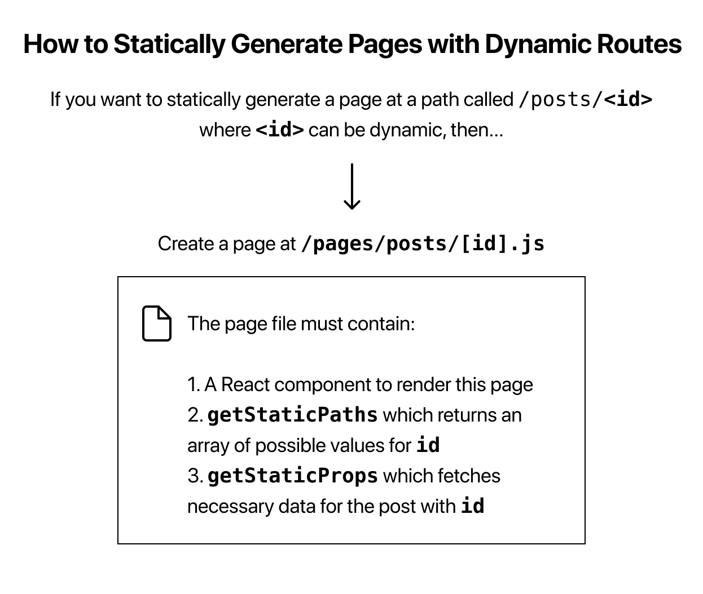

# 🖥 Create a Next.js App

<p> 이 readme 문서는 nextjs.org에서 제공하는 공식 문서인 <a href= "https://nextjs.org/learn/basics/create-nextjs-app" target="_blank">learn/basics </a>를 바탕으로 만들어 졌습니다.</p>

⌨️ Setup

```
npx create-next-app 프로젝트이름(nextjs-blog)
```

- npx 명령어를 통해 next 프레임워크를 다운로드합니다.
- `create-next-app` 은 사용자를 위한 기본적인 폴더 구조를 만들어 줍니다.
- 해당 프로젝명으로 이동합니다.

```
cd nextjs-blog
...

next run dev
```

- package.json에 자동으로 만들어진 dev 스크립트를 통해 next 개발 모드를 실행합니다
- next는 기본적으로 SSR(Server-Side Rendering)을 지원하기 위해 만들어진 프레임워크입니다
- next.js에서는 pages 폴더에 의해 라우팅이 지원되기 때문에 기존 리액트와 같은 라우터처리 방식을 따르지 않아도 됩니다

```js
<Route path="/something" components={something} />
```

- 위와 같은 형식으로 컴포넌트를 지정해주지 않아도 넥스트 라우터에 의해 라우팅됩니다.

- 넥스트 개발 서버는 빠른 리프레쉬가 가능합니다. 파일을 변화할 떄, 넥스트는 자동적으로 거의 즉시 브라우저에 변화를 적용합니다.
  > 새로 고침(Refresh)이 필요하지 않습니다.

# 🖥 Naviagate Between Pages

- 우리가 만든 nextjs 앱에는 초기에 한 개의 페이지밖에 존재하지 않습니다. 웹사이트들과 웹 어플리케이션들을 일반적으로 많은 페이지들을 가지고 있습니다.
- 이번 챕터에서는 integrated(통합된) file system routing을 사용하여 새로운 페이지를 만듭니다.
- 'Link' 컴포넌트를 사용하여 클라이언트 사이드 네비게이션을 만듭니다.
- 넥스트에서 지원하는 코드 스플리팅과 프리페칭에 대해 배웁니다.
<hr/>

- nextjs에서 페이지는 'pages' 디렉토리 안에 파일에 의해 exported된 리액트 컴포넌트입니다.

```
- `pages/index.js`는 '/' route 와 연관되어 있습니다.
- `pages/posts/first-post.js`는 '/posts/first-post' route와 연결되어 있습니다.
```

- 우리는 이미 pages 디렉토리를 가지고 있기 때문에 post/first-post.js를 안에 만들고 확인해봅니다.



- 주소(localhost:3000/posts/first-post)에 따라 우리가 만든 함수가 렌더링된 것을 볼 수 있습니다.

<hr/>

⌨️ Link Component

- 두 페이지를 연결(linking)하기 위해서는 `<a>`HTML tag를 사용합니다.
- nextjs에서 우리는 `Link` 컴포넌트를 `next/link`로 부터 제공받아 `<a>` 태그로 감싸 사용합니다.
- 이 링크 컴포넌트는 어플리케이션에서 다른페이지로의 클라이언트 사이드 네비게이션을 가능하도록 합니다.

```js
import Link from 'next/link';
...
📁 /pages/index.js

<h1>
  Read{' '}
  <Link href="/post/first-post">
    <a>this page!</a>
  </Link>
</h1>
```

```js
📁 pages/post/first-post.js

import Link from 'next/link';

export default function FirstPost() {
  return (
    <>
      <h1>First Post</h1>
      <h2>
        <Link href="/">
          <a>Back to home</a>
        </Link>
      </h2>
    </>
  );
}
```

- index 페이지와 first-post 페이지에 다음과 같은 코드를 추가합니다.
- 결과를 확인해봅니다.

<br/>

<hr/>

⌨️ Client-Side Navigation

- `Link` 컴포넌트는 두 페이지에서 같은 동작을하는 클라이언트-사이드 네비게이션을 가능하도록합니다.
- <a>클라이언트사이드 네비게이션</a>이란 브라우저에 의해 적용되는 기본값 네비게이션이 아닌, 자바스크립트를 사용하여 페이지를 더 빠르게 변화시키는 것을 의미합니다.

- 이를 확인할 수 있는 간단한 방법은 다음과 같습니다.

  > 브라우저의 개발자 도구를 사용하여 `background` CSS 속성 `<html>`을 `yellow`
  > 링크를 클릭하면 두 페이지 사이를 오갈 수 있습니다.
  > 페이지 전환 사이에 노란색 배경이 지속되는 것을 볼 수 있습니다.

<br/>

- 이는 브라우저가 전체 페이지를 로드하지 않고 클라이언트 사이드 네비게이션이 작동하고 있음을 나타냅니다.
- 만약 `Link href="/"` 대신 `a href="/"` 를 사용한다면, background color는 브라우저가 refresh 되면서 초기화될 것입니다.
- next.js 페이지에서 페이지 외부로 내보낼 때 `Link` 컴포넌트를 제외한 `a` 태그만을 사용합니다

<hr/>

⌨️ Code splitting and prefetching

- next.js는 코드 스플리팅을 자동적으로 하기 때문에, 각 페이지들은 그 페이지에 필수적인 요소들만 로딩합니다.
- 이것은 홈페이지(index)가 렌더링되더라도, 다른 페이지의 코드들은 초기에 렌더링되지 않는다는 것을 말합니다.
- 이 next.js의 기능은 개발자가 수백개의 페이지를 만들어 제공하더라도, 페이지를 신속히 로딩할 것을 보장합니다.

  > 모든 페이지를 다 다운받고 완벽한 페이지를 보여주는 것이 아니기 때문에 (필수적인 것들 먼저 로딩되면, 렌더링해주기 때문)

- 사용자가 요청한 페이지의 코드만이 로딩된다는 것은 페이지들이 고립될 수 있음을 의미합니다.
- 만약 특정 페이지에서 에러가 발생하더라도, 나머지 어플리케이션은 계속 작동할 것 입니다.

  > 정상적인 작동은 아니죠?

Summary

```
Note
만약 nextjs앱 외부에서 페이지에 링크를 주기 위해서는 <Link> 태그 없이 <a> 태그만 사용하면 됩니다.
만약 className과 같은 속성을 주고 싶으면 <Link>태그가 아닌, <a>태그 내부에 속성으로 className을 주면 됩니다.
```

<a href="https://github.com/vercel/next-learn-starter/blob/master/snippets/link-classname-example.js" target="_blank"> 예제 바로보기 </a>

# 🖥 Assets, Metadata, and CSS

- 이전 챕터까지는 styling이 없었기 때문에 지금부터 CSS 코드를 작성하여 페이지를 스타일링합니다
- nextjs는 CSS와 Sass를 지원하기 위해빌트인 요소를 가지고 있습니다
- 이번 챕터에서는 nextjs가 다루는 정적인 파일 (images, title 태그와 같은 page metadata)들에 대해 어떻게 다루는지 알 수 있습니다

<hr/>

⌨️ Assets

- 시작으로는 images와 같은 정적인 파일들을 nextjs가 어떻게 다루는 지 이야기해봅시다.
- nextjs는 images와 같은 정적인 파일들을 public 디렉토리를 통해 제공합니다.
- 위와 같은 정적인 파일들은 📁/public 디렉토리 안에 저장되는데, 이 프로그램의 📁/pages 디렉토리와 같은 역할이라고 볼 수 있습니다.

- pages/index 파일에 들어있는 favicon을 예로 들어봅시다.

```js

```

- vercel 이미지는 어플리케이션의 최상위 계층의 public 디렉토리에 존재합니다.
- 따라서 src 속성에서 따로 '/public' 이라는 경로를 설정하지 않아도 됩니다.

```
Note
오직 public 디렉토리에 들어있는 assets 들만이 빌드시에 next.js에 의해 제공됩니다
```

<a href="https://nextjs.org/docs/api-reference/next/image" target="_blank">next/image </a>에 대해 알아보기

<hr/>

⌨️ Metadata

- 우리가 `<title>` 과 같은 페이지의 메타 데이터 테그를 확인하고 싶으면 어떻게 해야 할까?
- `<title>` 태그는 `<head>` 태그의 일부이므로, 우리는 nextjs 페이지에서 `<head>` 태그를 통해 이 메타 데이터를 관리합니다.

```
import Head from 'next/head'
```

- 해당 명령어를 통해 nextjs에서 제공하는 Head 컴포넌트 모듈을 import 시킵니다.

```js
import Head from 'next/head';
import Link from 'next/link';

export default function FirstPost() {
  return (
    <>
      <Head>
        <title>First Post</title>
      </Head>
      <h1>First Post</h1>
      <h2>
        <Link href="/">
          <a>Back to home</a>
        </Link>
      </h2>
    </>
  );
}
```

- `<Head>` 컴포넌트를 사용하여 해당 페이지의 타이틀을 넣어줄 수 있습니다.

<hr/>

⌨️ CSS Styling

작성자(개인) 기준으로 스타일링은 빌트인 처리를 가장 많이 하는 것 같습니다.
추가적으로 styled-component를 사용하고, useMemo() 훅 함수를 사용하여 대부분의 css를 관리하게 됩니다.
빌트인 처리란 컴포넌트 요소 내부에 스타일링을 하는 것을 의미합니다.

<a href="https://nextjs.org/docs/basic-features/built-in-css-support" target="_blank">빌트인 CSS 자세히 알아보기</a>

<hr/>

⌨️ Layout Component

- 모든 페이지를 가로질러 공유할 수 있는 Layout 컴포넌트를 만들어 보자
- components라고 불리는 디렉토리를 만듭니다.
- 안에는 layout.js를 생성합니다.

```js
import styles from './layout.module.css';

export default function Layout({ children }) {
  return <div className={styles.container}>{children}</div>;
}
```

- 후에 우리가 만든 first-post.js를 Layout 컴포넌트로 감싸줍니다.
- Layout 컴포넌트 사이에 들어있는 코드를 children으로 받아와 styles안에 들어있는 container 속성을 적용시킵니다.

```js
import Head from 'next/head';
import Link from 'next/link';
import Layout from '../../components/layout';

export default function FirstPost() {
  return (
    <Layout>
      <Head>
        <title>First Post</title>
      </Head>
      <h1>First Post</h1>
      <h2>
        <Link href="/">
          <a>Back to home</a>
        </Link>
      </h2>
    </Layout>
  );
}
```

- 우리는 Layout 컴포넌트에 몇가지 스타일들을 추가할 것입니다.
- 그렇기 위해 우리는 리액트 컴포넌트에 CSS 파일들을 import 시킬 수 있도록 CSS Modules를 사용합니다.

```
Important: To use CSS Modules, the CSS file name must end with .module.css.
```

```js
✔️<div id= "__next">
  ✔️<div class="layout_container__2t4v2">
```

- CSS Modules를 사용하는 이유는 CSS Modules이 자동적으로 유니크한(중복이 없는) class names를 만들어주기 때문입니다.
- 몇개의 CSS 모듈을 사용하던지 간에, class name의 중복을 걱정할 필요가 없습니다.
- 게다가 nextjs의 코드 스플리팅의 특징은 CSS Modules에서 가장 잘 작동합니다.
- CSS Modules는 각페이지에서 적용되는 가장적은 CSS의 양(amount)을 장담합니다.

- 🌟CSS Modules는 빌드시에 자바스크립트 번들에서 추출될 수 있고, nextjs에 의해 자동적으로 css 파일이 로딩되도록 generate 합니다.🌟

<hr/>

⌨️ Global Styles

- 만약 모든 페이지(pages)에 CSS가 로딩된 상태이기를 원한다면 global CSS 파일을 사용해야합니다.
- pages 폴더 안에 `_app.js` 파일이 글로벌 스타일을 적용할 수 있는 파일입니다.
- styles 폴더는 CNA (Create Next App) 시에 만들어지는 styles 폴더로 next.js에서 제공하는 기본적인 스타일링 요소들이 들어 있습니다.

```js
import '../styles/globals.css';

function MyApp({ Component, pageProps }) {
  return <Component {...pageProps} />;
}

export default MyApp;
```

- next.js에서, 개발자는 글로벌 CSS 파일을 `pages/_app.js`를 import 시켜 사용할 수 있습니다.
- 하지만, 모든 곳에서 global CSS를 import할 수 있는 것은 아닙니다.
- 왜냐하면 global CSS는 모든 페이지의 모든 요소에 영향을 줄 수 있기 때문입니다. (의도와 상관없이 모든 페이지에서 적용될 수 있음)
- 만약, 너가 `post/first-post` 페이지로 가기 위해 홈페이지에서 navigate를 사용할 때, 홈페이지의 global styles가 `/posts/first-post`페이지에 의도치 않게 영향을 줄 수 있기 때문입니다.

<hr/>

⌨️ Polishing Layout

⌨️ <a href="https://nextjs.org/learn/basics/assets-metadata-css/styling-tips" target="_blank">Styling Tips</a>

# 🖥 Pre-rendering and Data Fetching

- Pre-rendering은 Next.js에서 중요한 컨셉 중 하나입니다. 기본적으로, nextjs는 모든 페이지를 pre-render합니다.
- <b>이는 nextjs가 client-side JavaScript로 모든 작업을 수행하는 대신 미리 각 페이지에 대해서 HTML을 만들어두는 것을</b>의미합니다.
- 이렇게 만들어진 HTML은 해당 페이지에 적은 자바스크립트 코드와 연관됩니다.
- 페이지가 브라우저에 로드될 때, 해당 자바스크립트 코드가 작동하고 완전한 인터렉티브 페이지가 되도록 만듭니다. 이를 <b>Hydration</b>이라고 합니다.
- Reactjs에서 초기 로딩시, App에서 아무것도 안보이는 것과 달리 nextjs에서는 초기 로딩시 HTML 코드를 pre-render 시킬 수 있습니다.

```
Note: You can also try the above steps on localhost, but CSS won’t be loaded if you disable JavaScript.
```

<br/>

⌨️ Two Forms of Pre-rendering

- nextjs의 Pre-rendering에는 두 가지 종류가 있습니다. Static Generation과 Server-side Rendering 입니다.
- 이 둘의 차이는 언제 페이지를 위한 HTML을 만드는 지에 있습니다.

🌟 Static Generation

- Static Generation은 HTML을 빌드 타임에 생성한다. pre-render된 HTML은 그 다음에 각 리퀘스트에서 재사용된다.
<p></p>

🌟 Server-side Rendering

- Server-side Rendering은 HTML을 각 리퀘스트가 일어날 때 생성하는 방식이다.
<p></p>

⌨️ Per-page Basis

- nextjs에서는 각 페이지당 어떤 처리방식으로 pre-rendering 할 것 인지를 개발자가 선택할 수 있습니다.

<p></p>

⌨️ Static Generation vs Server-side Rendering vs client-side

- 상황에 따라 써야하는 pre-rendering 방식이 다릅니다.
- 그 중에서 데이터가 없을 때는 Static Generation을 추천합니다.
- 왜냐면 페이지가 한번에 빌드 될 수 있고, 각 요청에 따라 페이지를 렌더하는데 속도가 빨라지기 때문입니다.
- 유저의 요청보다 먼저 해당 페이지를 렌더할 수 있는가 질문했을때 대답이 그렇다면 Static Generation을 사용해야 합니다.

- 반대로 유저의 요청보다 먼저 페이지가 렌더링되는 것이 좋지 않다면 Server-side Rendering을 사용해야 합니다.
- 자주 데이터를 업데이트 한다거나, 매 요청마다 콘텐츠가 달라지는 경우가 있을 겁니다.
- 렌더링 시간은 좀 더 걸리겠지만, 페이지는 항상 요청에 따른 업데이트가 되어 있을 것입니다.

- 아니면 그냥 자주 업데이트되는 데이터를 사용하는 경우 pre-rendering을 하지 않고 client-side에서 자바스크립트를 사용하는 것도 방법이 될 수 있습니다.

⌨️ Static Generation with and without Data

- Static Generation은 데이터가 있는 경우, 없는 경우 둘다 사용됩니다.
- So far(여태까지), 이전 챕터의 페이지들은 외부의 데이터(API, DataBase, ...)를 fetching할 필요가 없는 페이지들이였습니다.
- 이러한 페이지들은 어플리케이션이 빌드될 대 자동으로 정적인 상태로 생성됩니다.
- 하지만 몇몇의 페이지들은 외부 데이터를 fetching하지 않으면 렌더링될 수 없는 페이지들입니다.
- 아를 해결하기 위해 Static Generation with data를 사용합니다.

<p></p>

🌟 Static Generation with Data using `getStaticProps`

- 어떻게 Static Generation은 동작할까요?
- `getStaticProps()`라는 함수에 `async`(비동기) 함수를 export 하여 사용합니다.

```js
export default function Home(props){ ... }

export async function getStaticProps(){
  // API, DB, 기타 등등의 파일시스템의 외부 데이터들을 여기에 가져옵니다.
  const data = ...

  // 파라미터로 받아온 props key가 필요합니다.
  // Home 컴포넌트로 이를 전달합니다.
  return {
    props: ...
  }
}
```

- `getStaticProps`는 nextjs가 너에게 "야! 이 페이지 의존성이 필요한 데이터를 가지고 있어, 그니깐 빌드시에 이 페이지를 pre-render할 때,
  그 의존성이 필요한 데이터들을 첫 번째로 해결해야 해!"라고 말하는 것과 같다.

```
Note: In development mode, `getStaticProps` runs on each request instead
      (개발 모드에서는 getStaticProps가 각 요청에 계속 실행됩니다.)
```

⌨️ Blog Data

- `getStaticProps`를 사용하여 외부 데이터를 불러오는 작업을 할 것입니다.
- 현재 상황에서 DB 또는 API와의 연동된 데이터를 불러오는 것에는 한계가 있기 때문에, .md 파일로 만든 blog data를 활용합니다.
- .md 파일로 만들어진 데이터는 `title`과 `date`라는 metadata를 가지고 있습니다.
- 이것들을 gray-matter 라는 라이브러리를 사용하여 파싱되는 <b>YAML Front Matter</b>라고 불립니다.

🌟 Parsing the Blog Data on `getStaticProps`

- 이제 pages안에 index.js를 업데이트 해봅시다.
- 각각의 .md 파일에서 metadata인 `title`, `date`, `file name`을 추출할 겁니다. (file name은 post URL의 id로 사용될 겁니다.)

<p></p>

⌨️ Implement getStaticProps

- 처음에 `gray-matter` 라이브러리를 다운받아, 각 마크다운 파일의 메타데이터를 추출(parse)할 수 있게 해줍니다.
- root directory에 📁lib 디렉토리를를 만들고, 그 안에 posts.js라는 파일을 만듭니다.

```js
import fs from 'fs';
import path from 'path';
import matter from 'gray-matter';

const postsDirectory = path.join(process.cwd(), 'posts');

export function getSortedPostsData() {
  // Get file names under /posts
  const fileNames = fs.readdirSync(postsDirectory);
  const allPostsData = fileNames.map((fileName) => {
    // Remove ".md" from file name to get id
    const id = fileName.replace(/\.md$/, '');

    // Read markdown file as string
    const fullPath = path.join(postsDirectory, fileName);
    const fileContents = fs.readFileSync(fullPath, 'utf8');

    // Use gray-matter to parse the post metadata section
    const matterResult = matter(fileContents);

    // Combine the data with the id
    return {
      id,
      ...matterResult.data,
    };
  });
  // Sort posts by date
  return allPostsData.sort((a, b) => {
    if (a.date < b.date) {
      return 1;
    } else {
      return -1;
    }
  });
}
```

- 그리고 pages/index.js에서 lib에서 export 한 `getSortedPostsData`를 import하여 사용할 겁니다.
- 앞서 설명한 것 처럼 이 `getSortedPostsData()`를 allPostsData라는 변수로 만들어 props로 넘겨줄 겁니다.
- Home 컴포넌트에서 이 변수를 props로 받아와 사용(map 처리하여, li로 뽑아냄)합니다.
- 변경된 pages/index.js의 내용은 다음과 같습니다.

```js
import Head from 'next/head';
import Layout, { siteTitle } from '../components/layout';
import utilStyles from '../styles/utils.module.css';
import { getSortedPostsData } from '../lib/posts';

export async function getStaticProps() {
  const allPostsData = getSortedPostsData();
  return {
    props: {
      allPostsData,
    },
  };
}

export default function Home({ allPostsData }) {
  return (
    <Layout home>
      <Head>
        <title>{siteTitle}</title>
      </Head>
      <section className={utilStyles.headingMd}>
        <p>
          Hello, I'm JunHee. I'm a front engineer. You can contact me on{' '}
          <a href="https://github.com/junh0328">github</a>
        </p>
        <p>
          (This is a sample website - you’ll be building a site like this on{' '}
          <a href="https://nextjs.org/learn">our Next.js tutorial</a>.)
        </p>
      </section>
      <section className={`${utilStyles.headingMd} ${utilStyles.padding1px}`}>
        <h2 className={utilStyles.headingLg}>Blog</h2>
        <ul className={utilStyles.list}>
          {allPostsData.map(({ id, date, title }) => (
            <li className={utilStyles.listItem} key={id}>
              {title}
              <br />
              {id}
              <br />
              {date}
            </li>
          ))}
        </ul>
      </section>
    </Layout>
  );
}
```

- 실행된 결과물은 다음과 같습니다.

<p></p>

- `getStaticProps()` 를 사용하여 markdown files에 들어있는 metadata를 추출하여 이 데이터를 index.js/컴포넌트에 props 로 넘겨줘 사용하였습니다.
- 이처럼 `getStaticProps()`는 정적으로 사용자에게 미리 외부 데이터를 불러와 보여줄 수 있습니다.

🌟 Development vs. Production

- 개발 환경(`npm run dev` or `yarn dev`)에서, `getStaticProps`는 모든 요청에 작동합니다.
- 배포모드(Production)에서, `getStiaticProps`는 빌드 타임에만 작동합니다. 그러나 이 행동은 `getStaticProps`에 의해 리턴되는 `fallback`키의 사용을 강화합니다.
- 왜냐하면 빌드타임에만 작동한다는 것은, 너가 request time 동안에만이 데이터의 이용이 가능하기 때문입니다.

🌟 What if I Need to Fetch Data at Request Time?

- `Static Generation`은 유저의 요청에 즉각적이 변화를 담을 수 없기 때문에, pre-render page를 이용할 때는 적합하지 않습니다.
- 모든 요청에 즉각적인 컨텐트의 변화를 즉시 가져갈 수 없기 때문입니다.
- 이러한 경우에는 `Server-side Rendering`을 사용하거나, pre-rendering을 skip하면 됩니다.

⌨️ Fetching Data at Request Time

- 만약 너가 빌드 타임 대신에 request time에 데이터를 추출(fetch)하기를 원한다면, 너는 서버사이드(Server-side Rendering) 렌더링을 사용해야 합니다.

<p></p>

- 서버사이드 렌더링을 사용하기 위해서는 너는 `getStaticProps`로 만들어진 페이지에 `getServerSideProps`를 대신하여 export 해야 합니다.

🌟 Using `getServerSideProps`

- getServerSideProps의 예제 코드는 다음과 같습니다.

```js
export async function getServerSideProps(context) {
  return {
    props: {
      // props for your component
    },
  };
}
```

- `getServerSideProps`는 request time에 호출되기 때문에, {`context`} 파라미터에는 요청시에 특별한 파라미터들이 포함합니다.
- 이 context를 통해 서버에 저장된 데이터를 불러와 사용자에 요청에 따라 렌더링을 해주는 것이 서버사이드렌더링입니다.
- 하지만, `getStaticProps` 보다는 느릴 겁니다. 왜냐하면 서버는 무조건 모든 요청에 따라 결과물을 보내줘야 하고, 그 결과가 여분의 configuration 없이는 캐싱되지 않기 때문입니다.

🌟 Client-side Rendering

- 만약 너가 데이터를 pre-render 할 필요가 없다면, 그냥 CSR 전략을 사용해도 됩니다.
  > 외부 데이터를 요구하지 않을 경우
  > 페이지 로드 됐을 때, 자바스크립트를 사용하여 사용자의 외부데이터를 가져옵니다.

<p></p>

- 예를 들어 유저의 대쉬보드 페이지를 위해서는 이러한 접근법이 효과적입니다.
- 왜냐하면 대쉬보드는 개인적이고, 유저 특화적인 페이지이기 때문에 SEO(Search Engine Optimization)는 연관이 없고, 이 페이지는 pre-rendered 될 필요가 없기 때문입니다.

<h4>🌟 SEO(Search Engine Optimization)</h4>

<p>SEO란, Search Engine Optimization의 약자로, 구글, 네이버와 같은 검색 엔진들은 서버에 등록된 웹사이트를 하나하나씩 돌아다니면서 웹사이트의 HTML 문서를 분석해줍니다. 이때 HTML에 사용된 태그를 바탕으로 사용자가 검색할 때 웹사이트를 빠르게 검색할 수 있게 도와줍니다. 하지만, CSR에서 사용되고있는 HTML의 body는 텅텅 비어 있다가, 사용자가 해당 도메인을 가진 페이지에 접근하면, 서버에서 js 밑 html 태그를 불러오는 형식이기 때문에 검색엔진을 통해 사용자가 입력하여 얻고자하는 정보를 입력했을때, 검색엔진이 우리의 웹 사이트에서 해당 내용을 캐치하는데 어려움이 있습니다.(why? html이 비어 있다가, 사용자가 해당 페이지에 접속하면 정보를 불러와 보여주는 형식이기 때문에). CSR 즉, 클라이언트 서버에서 html 및 js를 다루는 것 대신에, SSR을 사용하여 사전에 html 문서를 검색엔진이 찾을 수 있도록 제공하여 SEO를 향상시킬 수 있게 됩니다. SSR은 서버에서 필요한 데이터를 모두 가져와서 html 파일을 만들게 되고 이렇게 만들어진 HTML 파일을 일부 초기 세팅에 필요한 js와 함께 클라이언트 서버에 보내주게 됩니다. 그러면 클라이언트 측에서는 서버에서 만들어준 문서를 받아 와서 바로 사용자에게 보여줄 수 있게 되는 거죠. 이렇게 SSR을 사용하게 되면 사전에 HTML 문서를 클라이언트 측으로 전달했기 때문에, 페이지 로딩이 빨라지고, 검색엔진이 사용자의 요청에 따라 검색어를 찾을 때, 우리의 웹사이트에 해당 검색어가 포함되어 있다면 우리 페이지를 보여주는 효율적인 SEO가 될 수 있습니다. </p>

<p>하지만 SSR이 CSR의 모든 문제점에 해결책이 되지는 않습니다. 서버에서 데이터를 사전에 받아오는 것이기 때문에 첫 번째로 blinking issue가 여전히 존재하고, 두 번째로 사용자가 증가함에 따라 서버는 더 많은 데이터를 가지고 와서 HTML을 만들어야 하므로 과부화가 올 수 있습니다. 마지막으로 사용자가 빠르게 웹사이트를 확인할 수는 있지만, js가 완전히 다운로드 되지 않은 상태에서 페이지의 여러 부분을 클릭하면, 작동이 되지 않는 부분이 존재할 것입니다.  </p>

<h4>TTV(Time To View) , TTI(Time To Interact)</h4>

<p>CSR은 사용자에게 보여짐과 동시에 모든 html과 js를 불러온 상태이기 때문에, TTV과 됨과 동시에 TTI 모든 동적인 행동을 할 수 있게 됩니다.</p>

<p>하지만, SSR은 html과 일부 js파일은 서버로부터 사전에 받아 놓았기 때문에 TTV 상태에서도 TTI가 전부 활성화되어 있지는 않습니다.</p>

<p>최종적으로 CSR을 많이 사용한다면, 우리가 최종적으로 번들링하여 사용자게에 보내주는 js 파일을 어떻게 하면 효율적으로 많이 분할하여 첫 번째로 사용자가 보기 위해서 필요한 정말 필수적인 html 요소만 보낼 수 있을지 고민해봐야 하고, SSR의 경우 사용자가 보고, 인터렉션(TTI)하는 이 시간의 단차를 줄이기 위해서 어떤 노력을 할 수 있을지 고민해봐야 합니다. 예를 들면 어떻게 하면 조금 더 매끄러운 UI와 UX를 제공할 수 있을지에 대한 고민들이 포함됩니다. </p>

<p>요즘에는 SSR, CSR 뿐만 아니라 SSG(Static Site Generation)또한 렌더링 방법으로 등장하였습니다. SSG는 리액트를 예로 들면 'Gatsby' 또는 'Next'와 같은 라이브러리를 추가적으로 사용하여 렌더링을 하는 것인데, 웹페이지를 정적으로 미리 생성해두고, 서버에 배포해놓는 것입니다. SSG에서도 자바스크립트 파일을 html 파일과 함께 가지고 있을 수 있기 때문에, 동적인 요소도 충분히 추가할 수 있습니다. 
Next에서는 SSR뿐만 아니라, static generation, no pre-rendering, pre-rendering상태를 모두 지원하기 때문에 리액트로 작업을 계속한다면 next.js를 배워보는 것도 매우 효과적일 겁니다.</p>

<p>어떤 것이 최고다, 제일 낫다라는 판단 보다는 우리가 만들어야 하는 웹사이트 특성에 맞게 다양한 방식의 렌더링을 활용하여 페이지를 구성한다면 최선의 선택이 될 것입니다.</p>

🌟 SWR

- nextjs팀은 'SWR' 불리는 데이터를 추출하는 리액트 훅을 만들었습니다.
- 이것은 클라이언트 사이드에서 데이터를 추출할때 매우 유용합니다.
- 이것은 caching, revalidation, focust tracking, refetching on interval을 다룹니다.

- 사용법은 다음과 같습니다.

```js
import useSWR from 'swr';

function Profile() {
  const { data, error } = useSWR('/api/user', fetch);

  if (error) return <div> failed to load </div>;
  if (!data) return <div> loading... </div>;

  return <div> hello {data.name}! </div>;
}
```

# 🖥 Dynamic Routes

⌨️ Page Path Depends on External Data

- 이번 챕터에서는 외부데이터에 의존하는 각각의 page path에 대해 공부합니다.
- nextjs는 외부데이터에 의존하는 경로를 가진 페이지들을 generate 하도록 것을 도와줍니다.

<p></p>

🌟 How to Statically Generate Pages with Dynamic Routes

- 우리는 다이나믹 라우팅을 통해 각 포스트가 `/posts/<id>`와 같은 주소를 갖기를 원합니다.
- 그 주소는 posts 디렉토리 안에있는 마크다운(.md) 파일들의 이름입니다.
- 이 다이나믹 라우팅 기능은 pages/posts 폴더의 하위 파일에 `[id].js`로 생성될 것입니다.
- 이 `[ ]` 대괄호를 통해 다이나믹 라우팅을 nextjs에서 사용할 수 있습니다.

- `[id].js` 파일에 Layout 컴포넌트를 추가합니다.

```js
import Layout from '../../components/layout';

export default function Post() {
  return <Layout>...</Layout>;
}
```

- 후에 우리는 `getStaticPaths`라 불리는 함수를 이페이지에서 사용할 것입니다.
- 이 함수는 `id`를 위한 possible values 배열을 리턴해야 합니다.

```js
import Layout from '../../components/layout';

export default function Post() {
  return <Layout>...</Layout>;
}

export async function getStaticPaths() {
  // 여기에 id 를 위한 possible value의 배열을 리턴합니다.
}
```

- 마지막으로, 우리는 향상된 (?) `getStaticProps`가 필요합니다.
- 왜? blog post와 함께 주어진 `id`라는 반드시 필요한 데이터를 fetch하기 위해서!
- `getStaticProps`는 `id`라는 파라미터를 가지고 있습니다
- 왜 ? filename이 `[id].js`라서

```js
import Layout from '../../components/layout';

export default function Post() {
  return <Layout>...</Layout>;
}

export async function getStaticPaths() {
  // 여기에 id 를 위한 possible value의 배열을 리턴합니다.
}
export async function getStaticProps({ params }) {
  // Fetch necessary data for the blog post using params.id
  // params.id 를 사용하여 블로그 포스트에서 필요한 데이터를 추출합니다.
}
```

⌨️ Implement getStaticPaths

- pages/posts 디렉토리 안에 `[id].js` 라는 다이나믹 라우팅을 할 파일을 만듭니다.
- pages/post 폴더는 더이상 필요 없으므로 지워도 괜찮아요

- 📁lib/posts.js에 해당 코드를 기존 코드 밑에 추가합니다.

```js
export function getAllPostIds() {
  const fileNames = fs.readdirSync(postsDirectory); // postsDirectory는 같은 계층의 폴더인 posts 폴더를 나타냅니다.

  // Returns an array that looks like this:
  // [
  //   {
  //     params: {
  //       id: 'ssg-ssr'
  //     }
  //   },
  //   {
  //     params: {
  //       id: 'pre-rendering'
  //     }
  //   }
  // ]
  return fileNames.map((fileName) => {
    return {
      params: {
        id: fileName.replace(/\.md$/, ''),
      },
    };
  });
}
```

- 중요한 것은 리턴되는 fileNames 배열은 매핑되면서 [ { ... }, { ... }]의 배열 형식으로 분리되는데, 반드시 파라미터로 id를 가져야 합니다.
- id 가 없으면, `[id].js` 파일에서 파라미터로 이 키인 id를 받아오지 못해 `getStaticPaths`가 실패할 것입니다.

- 마지막으로 `getAllPostIds()` 함수를 `[id].js` 파일에 import 해주세요

```js
import Layout from '../../components/layout';
import { getAllPostIds } from '../../lib/posts';
import { getStaticPaths } from '../../lib/posts';

export async function getStaticPaths() {
  const paths = getAllPostIds();
  return {
    paths, // getAllPostIds() 함수에 의해 리턴되는 path 배열을 가지고 있습니다. [{ id : pre-rendering },{ id: ssg-ssr } ]
    fallback: false, // fallback 속성은 나중에 설명합니다.
  };
}

export default function Post() {
  return <Layout>...</Layout>;
}
```

⌨️ Implement getStaticProps

- 우리는 주어진 id 와 함께 필요한 데이터를 post에 렌더링해야 합니다.
- 그러기 위해서 📁lib/posts.js 를 다시 열어 getPostData 함수를 추가해야 합니다.

```js
export function getPostData(id) {
  const fullPath = path.join(postsDirectory, `${id}.md`);
  const fileContents = fs.readFileSync(fullPath, 'utf8');

  // gray-matter 라이브러리를 이용하여 metadata 섹션의 포스트를 추출합니다.
  const matterResult = matter(fileContents);

  // id와 추출한 데이터를 합칩니다.
  return {
    id,
    ...matterResult.data,
  };
}
```

- 그리고 📁pages/posts/`[id].js` 파일을 다음과 같이 수정합니다.

```js
import Layout from '../../components/layout';
import { getAllPostIds, getPostData } from '../../lib/posts';

export default function Post({ postData }) {
  console.log(postData);
  return (
    <Layout>
      {postData.title}
      <br />
      {postData.id}
      <br />
      {postData.date}
    </Layout>
  );
}
export async function getStaticPaths() {
  const paths = getAllPostIds();
  return {
    paths, // getAllPostIds() 함수에 의해 리턴되는 path 배열을 가지고 있습니다. [{ id : pre-rendering },{ id: ssg-ssr } ]
    fallback: false, // fallback 속성은 나중에 설명합니다.
  };
}

export async function getStaticProps({ params }) {
  const postData = getPostData(params.id);
  return {
    props: {
      postData,
    },
  };
}
```

🌟 Summary

<p></p>

전반적인 내용은 모두 다뤘습니다. !!!!! <br/>
더 자세한 내용은 nextjs의 <a href="https://nextjs.org/docs/getting-started">API References</a>를 참고해 주세요

다이나믹 라우팅을 더 간단하게 만들어 주는 useRouter와 같은 Hooks 들이 더 많이 있습니다.
